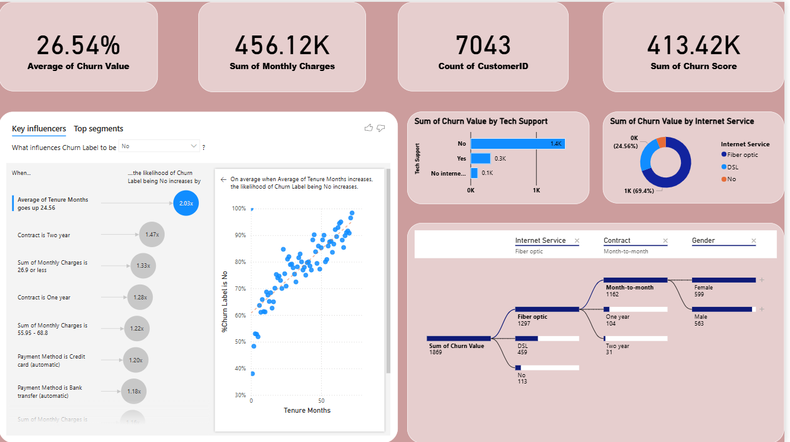

# Telco Customer Churn Prediction & BI Dashboard
An end-to-end Data Science and Business Intelligence project that predicts customer churn and provides deep business insights to reduce churn rate for a telecommunication company.

##  Project Overview
Customer churn is a critical metric for subscription-based businesses. This project builds an automated machine learning pipeline to identify high-risk customers and develops an interactive Power BI dashboard to analyze key churn drivers.

##  Tech Stack & Tools
* **Programming Language:** Python
* **Libraries:** Pandas, PyCaret, Openpyxl
* **Machine Learning:** Logistic Regression (optimized for stable cross-platform execution)
* **Data Visualization & BI:** Power BI
* **Development Environment:** VS Code, Jupyter Notebook

## Project Workflow
1. **Data Preprocessing & Cleaning:** 
   - Handled data type mismatches and missing values.
   - Prepared feature sets for model training.
2. **Machine Learning Model (PyCaret):**
   - Implemented an automated ML pipeline to evaluate classification models.
   - Deployed Logistic Regression to generate robust churn predictions (`Customer_Churn_Predictions.csv`).
3. **Interactive Power BI Dashboard:**
   - Designed a single-page executive dashboard featuring KPI cards (Churn Rate, Revenue at Risk), Key Influencers, Decomposition Tree, and custom visual  breakdowns.

## Dashboard Preview

##  Key Insights from the Dashboard
* **Contract Type:** Month-to-month contract customers show significantly higher churn rates compared to those on 1-year or 2-year contracts.
* **Internet Service:** Customers using Fiber Optic internet service experience higher churn tendencies.
* **Tenure:** Newer customers (lower tenure months) are at the highest risk of leaving.
